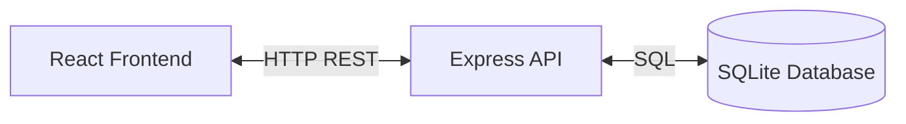

# Malulos POS

**Malulos POS** is a Point of Sale system designed for fast-food restaurants. It features a client-server architecture with a React frontend and an Express.js backend using a centralized SQLite database, supporting multiple simultaneous devices (waiters, kitchen, cashier).

## 🏗 Architecture

The system follows a Client-Server model:

*   **Frontend:** React 18 + TypeScript + Vite (Port 5174)
*   **Backend:** Node.js + Express.js (Port 3000)
*   **Database:** SQLite (`server/malulos.db`) via `better-sqlite3`



## 🚀 Getting Started

### Prerequisites
*   Node.js 18+
*   npm

### Installation

1.  **Install Dependencies:**
    ```bash
    npm install
    cd server && npm install && cd ..
    ```

2.  **Initialize Database:**
    *   **Crucial:** This must be run before starting the app to create tables and seed data.
    ```bash
    npm run init-db
    ```

3.  **Start Development Servers:**
    *   Runs both frontend and backend concurrently.
    ```bash
    npm run dev:all
    ```

### Other Commands
*   `npm run dev` - Frontend only.
*   `npm run dev:server` - Backend only.
*   `npm run build` - Build frontend for production.
*   `npm run lint` - Run ESLint.

## 📂 Project Structure

### Root Directory
*   `server/` - Backend API code and database.
    *   `src/config/initDb.js` - Database schema and seed data.
    *   `malulos.db` - SQLite database file (created after init).
*   `src/` - Frontend React application.

### Frontend Structure (`src/`)
*   `components/`
    *   `auth/` - PIN pad, route protection.
    *   `cash/` - Cash session guards.
    *   `layout/` - Main app layout.
    *   `payment/` - Payment processing modals.
*   `pages/` - Main views (Home, Orders, Kitchen, etc.).
*   `stores/` - Global state management (Zustand).
    *   `authStore.ts` - User auth & permissions.
    *   `cashStore.ts` - Cash session state.
    *   `cartStore.ts` - Shopping cart logic.
*   `types/` - Centralized TypeScript definitions (`index.ts`).
*   `db/` - Legacy Dexie configuration (transitioning to SQLite).

## 🔑 Key Concepts

### Authentication & Roles
*   **Login:** PIN-based authentication.
*   **Roles:** `admin` (1234), `cashier` (2222), `waiter` (3333).
*   **Permissions:** Granular permissions defined in `src/types/index.ts`.

### Cash Management
*   **Requirement:** A cash session must be open (`/cash`) to take orders.
*   **Guards:** `CashGuard` blocks access to operational routes if no session is active.

### Offline/PWA
*   The application is configured as a PWA using `vite-plugin-pwa`.
*   **Note:** While designed with offline capabilities in mind, the current architecture relies on the backend API for data persistence.

## 🛠 Development Conventions

*   **Styling:** CSS Modules (`*.module.css`) for component-scoped styles.
*   **State:** Zustand for global client state.
*   **Type Safety:** Strict TypeScript usage. No implicit `any`.
*   **Path Aliases:** Use `@/` to reference `src/`.
*   **Icons:** `lucide-react`.

## 🌐 Network Access

The development server is configured to listen on `0.0.0.0`, allowing access from other devices on the local network (e.g., `http://192.168.1.X:5174`).
